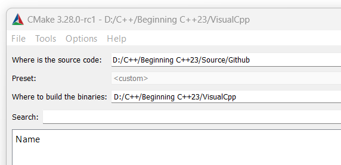
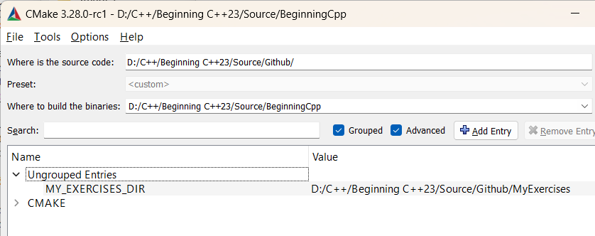
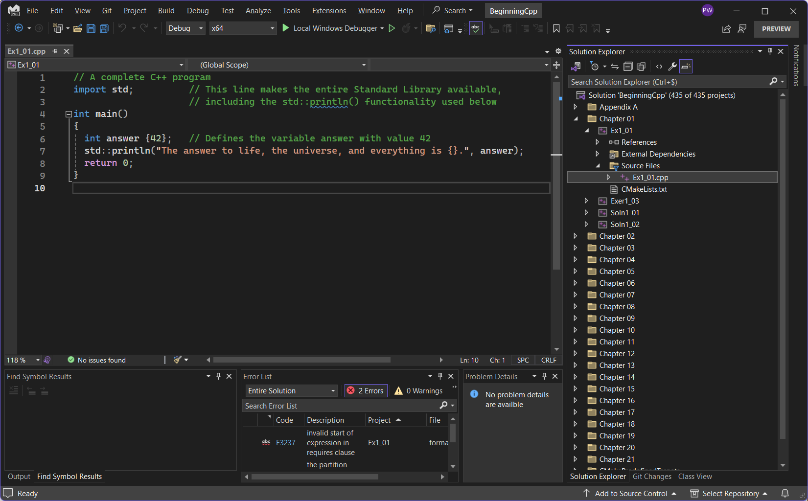
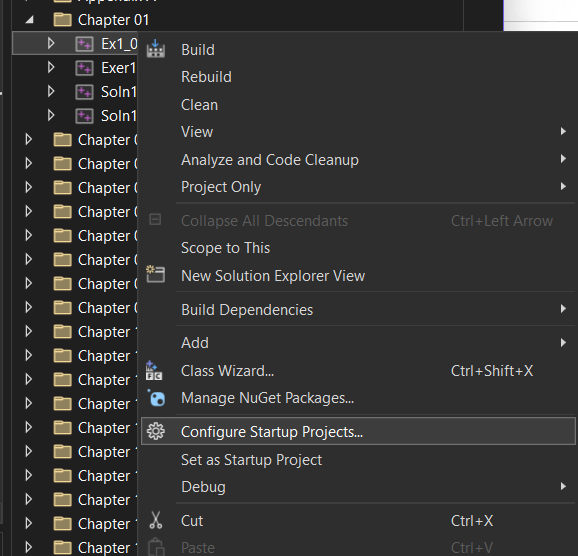
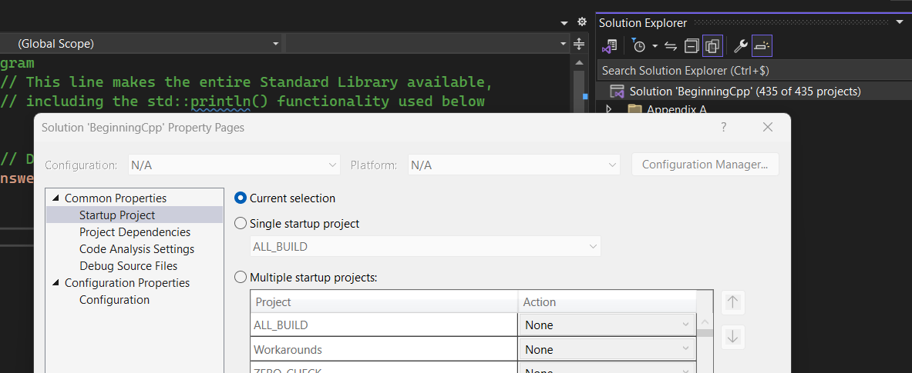

# Compiling the Source Code

Except where we erred on purpose (see book), all online source code is valid C++23.
So in principle all you need is a C++23 compliant compiler.
Unfortunately, though, at the time of writing, no compiler supports all latest features.
See https://en.cppreference.com/w/cpp/compiler_support for an overview of C++ compiler support.

Visual Studio is the only mainstream compiler to officially support modules,
making it is by far the easiest option to get started with C++23.
It is also the compiler we used when preparing the book.

> [!WARNING] 
> Compiling our source code with GCC and Clang is currently significantly harder because 
> these compilers do not have released (strong) support for modules yet.
> We are still looking into what is possible with GCC and Clang,
> but for now we recommend you try to use Visual Studio instead.

## Compiling with Visual Studio

The Community edition of Visual Studio is free for students, open-source contributors, and individuals.
We used the Visual Studio preview edition available from https://visualstudio.microsoft.com/downloads/.

### Generating the Project Files with CMake (Recommended)

Once you have a sufficiently recent version of Visual Studio installed, 
we recommend you install [CMake](https://cmake.org/download/) (version 3.28 or later).
Through the CMake GUI you can then generate all necessary Visual Studio project files as follows:

1. Point CMake to the location of the source code 
   (the root directory of your Git working directory,
   where the CMake configuration file [CMakeLists.txt](./CMakeLists.txt) is located),
   and choose where CMake should generate the project files 
   (referred to as "binaries" in the CMake GUI).
   
   
   
1. Press the Generate button at the bottom of the window.
   When asked to specify a generator, select "Visual Studio 17 2022".
   All other options can be left default.
   
> [!NOTE]
> Our CMake script also generates stub projects for you to use when solving the books exercises
> (one pre-configured project per exercise).
> By default it generates these in a `MyExercises` folder 
> next to the existing `Exercises` and `Examples` folders.
> To override this, you alter the `MY_EXERCISES_DIR` variable in the CMake GUI 
> (available after pressing Configure or Generate a first time).

### Compiling and Running 

Open the `BeginningCpp.sln` solution file generated by CMake in Visual Studio,
and locate the Solution Explorer window.
You should find projects for all examples and exercises of the book, grouped per chapter.

For each exercise, there is one stub project from which you can start when solving the exercise,
and one project containing our reference solution.
   
For your convenience, 
we highly recommend you to let Visual Studio use the currently selected project as "Startup project".
That way you can easily switch between our many different projects, 
and immediately compile and run the resulting executable.
You do so in the Solution Explorer by right clicking 
either on the solution node (labeled "Solution 'BeginningCpp' (554 of 554 projects)") and selecting Properties,
or on any of the project nodes and selecting "Configure Startup Projects...".
   

   
Either way, under Common Properties &blacktriangleright; Startup Project, select "Current selection":
   

   
Once that's done, you simply select any of the projects or opened files, 
and press the green arrow in the toolbar at the top to compile and run the active project.

### Configuring Your Own Visual Studio Projects

When creating your own Visual Studio project:
- Under General &blacktriangleright; C++ Standard Language select "Preview - Features from the Latest C++ Working Draft (/std:c++latest)"
- Easiest it to set C/C++ &blacktriangleright; General &blacktriangleright; Scan Sources for Module Dependencies to "Yes"
- Force include the [`workarounds.h`](Workarounds/workarounds.h) header by specifying it in C/C++ &blacktriangleright; Advanced &blacktriangleright; Forced Include File. You'll need to add the`Workarounds` folder to C/C++ &blacktriangleright; General &blacktriangleright; Additional Include Directories first.
