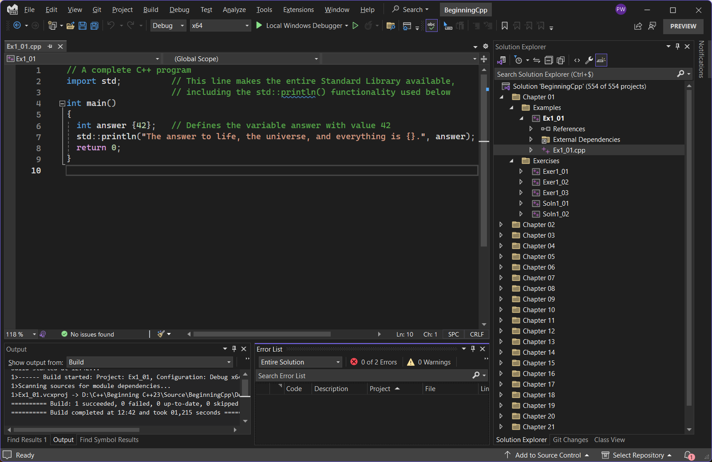

# Compiling the Source Code

Except where errors are made on purpose (see book), all source code is valid C++23.
So in principle all you need is C++23 compliant compiler.
Unfortunately, at the time of writing, not all compilers support this yet.
See https://en.cppreference.com/w/cpp/compiler_support/23 for an overview the compiler support for C++23.

At the time of writing, 
the easiest option to get started with C++23, and modules in particular, is Visual Studio.

## Compiling Using Visual Studio

The Community edition of Visual Studio is free for students, open-source contributors, and individuals.
We used the Visual Studio preview edition available from https://visualstudio.microsoft.com/downloads/
(the officially released versions may still lack some C++23 features).

### Generating the Project Files

Once you have a sufficiently recent Visual Studio installed, 
we recommend you install [CMake](https://cmake.org/download/) (version 3.28 or later).
Through the CMake GUI you generate a set of Visual Studio project files as follows:

1. Point CMake to where the source code is (the root directory of your Git working directory, where [CMakeLists.txt](./CMakeLists.txt) is located),
   and where you want CMake to write the project files (referred to as "binaries" in the CMake GUI).
   
   
   
1. Press the Generate button at the bottom of the window.
   When asked to specify a generator, select "Visual Studio 17 2022".
   All other options can be left default.

### Compiling and Running 

You start by opening the `BeginningCpp.sln` file generated by CMake in Visual Studio.
If you then locate the Solution Explorer window, 
you should find one project per example and exercise of the book, grouped per chapter.

   
All source files are available from the "Source Files" folders under each project.
Double clicking a source file opens it for editing.
   
For your convenience, we recommend you configure Visual Studio so that the so called "Startup project" tracks the currently selected project.
That way you can easily switch between our many different projects, compile their code, and run the resulting executable.
You can do so in the Solution Explorer by right clicking either on the solution node (labeled "Solution 'BeginningCpp' (435 of 435 projects)") and selecting Properties,
or on any of the project nodes and selecting "Configure Startup Projects...".
   

   
Either way, under Common Properties &blacktriangleright; Startup Project, select "Current selection":
   

   
Once that's done, you simply select any of the projects or opened files, 
and press the green arrow in the toolbar at the top to compile and run the active project.
