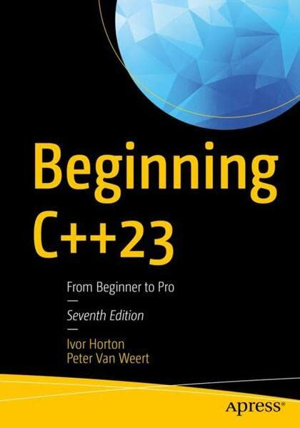

# Apress Source Code

This repository accompanies [*Beginning C++23*](https://link.springer.com/book/10.1007/978-1-4842-9343-0) by Ivor Horton and Peter Van Weert (Apress, 2023).

Download the files as a zip using the green button, or clone the repository to your machine using [Git](https://docs.github.com/en/get-started/quickstart). 

## Compiling

Except where errors are made on purpose (see book), all source code is valid C++23.
See https://en.cppreference.com/w/cpp/compiler_support/23 for an overview the compiler support for C++23.
Our [Workarounds](workarounds) section may assist you in working around any missing features.

## Contributions

See the file [Contributing.md](Contributing.md) for more information on how you can contribute to this repository.
